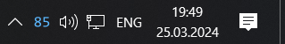

# Sora Tray Charge Notification

## Introduction
<!--   -->
This is a script for **Windows** written in Python 3.10+ with `wxPython` and `hidapi` that gets the battery level of a **Ninjutso Sora V2** Wireless mouse and shows it in system tray. 

## Instruction
1. Clone this repository.
2. Install dependencies: `pip install -r requirements.txt`
3. Change extension of script file from `sora_tray.py` to `sora_tray.pyw` if you don't want to see console output 

## Settings
You can modify these settings variables:
1. `poll_rate` in seconds - how often battery charge is read. 60 sec by default.
2. `foreground_color` - color of indicator text. Tuple with RGB data.
3. `backgroung_color` - color of indicator background. Transparent by default (0, 0, 0, 0).
4. `font` - indicator font.